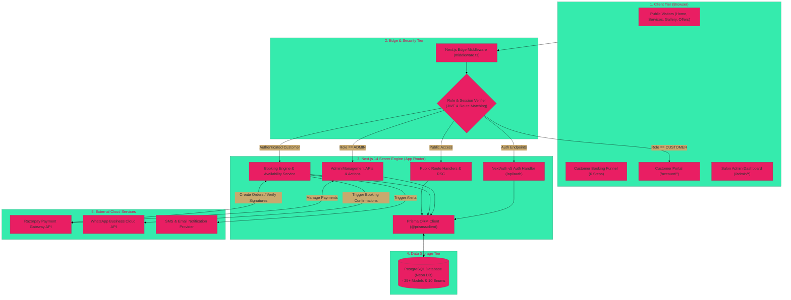
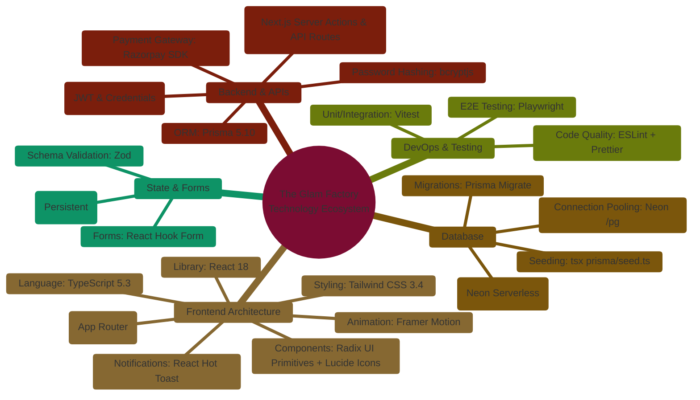
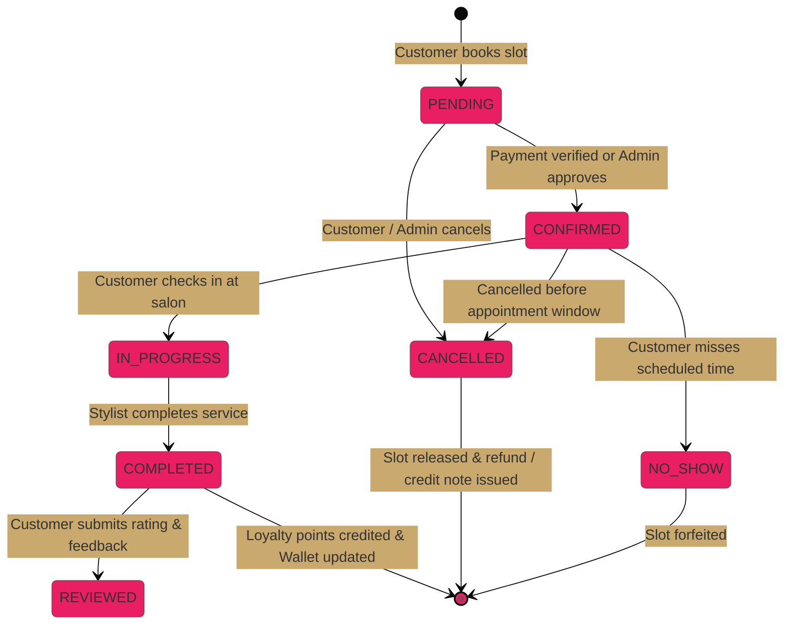
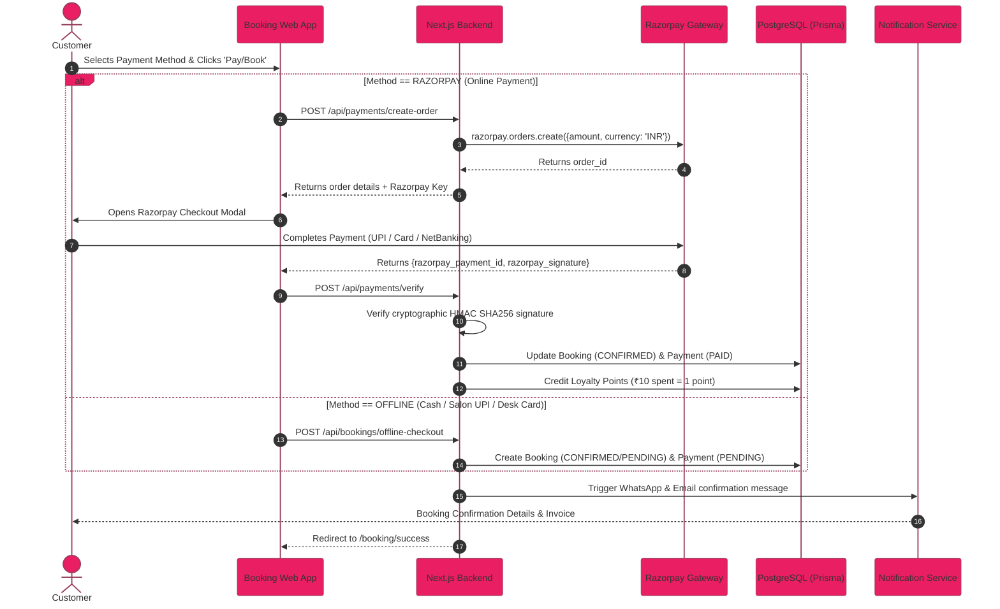
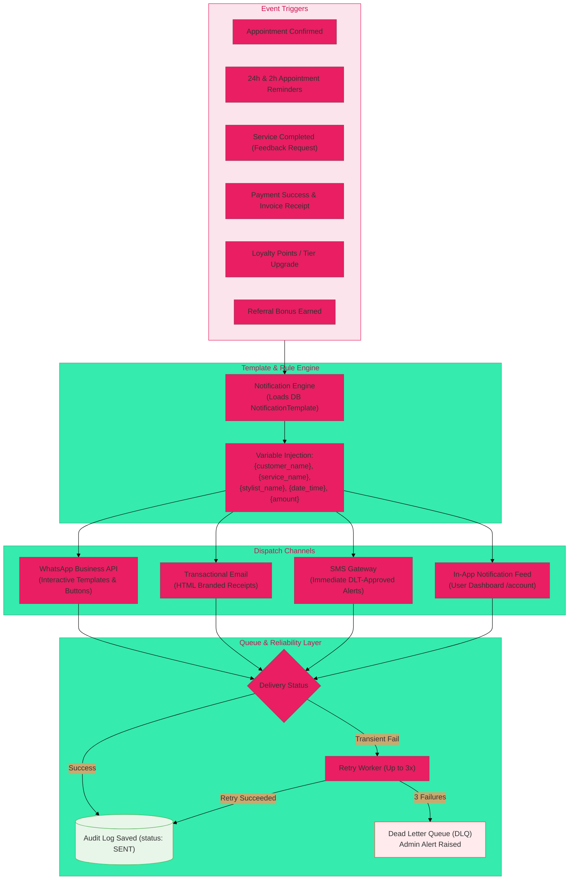
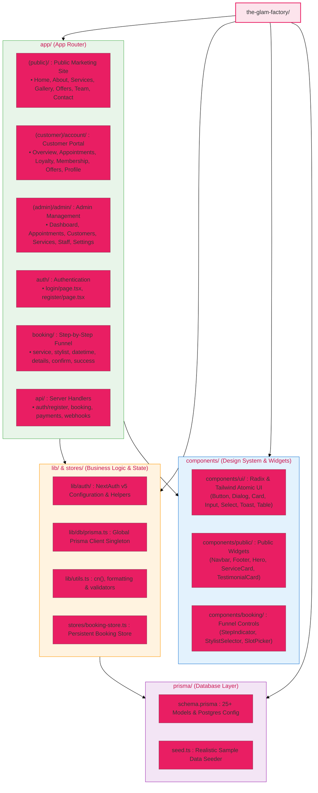

# The Glam Factory — Full System Architecture & Diagram Report

A comprehensive technical architecture report and visual system specification for **The Glam Factory**, an enterprise-grade luxury salon booking and salon operations management platform built on Next.js 14, Prisma ORM, PostgreSQL, NextAuth.js, and Razorpay.

---

## 1. High-Level System Architecture

This diagram illustrates the multi-tier topology: Client presentation tier, Edge middleware routing, Next.js Server App Router, Prisma ORM abstraction, PostgreSQL database, and 3rd-party integration services (Razorpay, WhatsApp Business API, and Email/SMS).



---

## 2. Technology Stack Landscape

A complete mindmap detailing frontend, backend, database, state management, security, and infrastructure layers.



---

## 3. Comprehensive Entity-Relationship Diagram (Database Schema)

The database schema manages user accounts, role definitions, stylists and dynamic shift availabilities, service categories with modular add-ons, multi-item bookings, payment receipts, wallet balance ledger, loyalty rewards, referral programs, promotional vouchers, customer memberships, and customer reviews.

```mermaid
erDiagram
    %% Entities & Relations
    USER ||--o| STYLIST : "has profile (if STYLIST)"
    USER ||--o{ BOOKING : "places"
    USER ||--o{ PAYMENT : "makes"
    USER ||--o| WALLET : "owns"
    USER ||--o{ LOYALTY_TRANSACTION : "earns/redeems"
    USER ||--o{ MEMBERSHIP : "subscribes"
    USER ||--o{ REFERRAL : "acts as referrer"
    USER ||--o{ REFERRAL : "acts as referee"
    USER ||--o{ NOTIFICATION : "receives"
    USER ||--o{ REVIEW : "writes"

    STYLIST ||--o{ STYLIST_AVAILABILITY : "maintains"
    STYLIST ||--o{ STYLIST_SERVICE : "specializes in"
    STYLIST ||--o{ BOOKING : "assigned to"
    STYLIST ||--o{ REVIEW : "evaluated in"

    SERVICE_CATEGORY ||--o{ SERVICE : "categorizes"
    SERVICE ||--o{ SERVICE_ADDON : "offers options"
    SERVICE ||--o{ STYLIST_SERVICE : "mapped to"
    SERVICE ||--o{ BOOKING_SERVICE : "included in"
    SERVICE ||--o{ OFFER_SERVICE : "discounted via"

    BOOKING ||--o{ BOOKING_SERVICE : "contains services"
    BOOKING ||--o{ BOOKING_ADDON : "contains add-ons"
    BOOKING ||--o| PAYMENT : "reconciled with"
    BOOKING ||--o| REVIEW : "rated through"

    WALLET ||--o{ WALLET_TRANSACTION : "logs entries"

    MEMBERSHIP_PLAN ||--o{ MEMBERSHIP : "defines tier"
    MEMBERSHIP ||--o{ MEMBERSHIP_PAYMENT : "bills"

    REFERRAL_PROGRAM ||--o{ REFERRAL : "governs"
    NOTIFICATION_TEMPLATE ||--o{ NOTIFICATION : "formats"
    OFFER ||--o{ OFFER_SERVICE : "applies to"

    %% Attribute specifications
    USER {
        string id PK
        string email UK
        string passwordHash
        string name
        string phone
        string avatarUrl
        UserRole role "CUSTOMER | ADMIN | STYLIST"
        boolean isVerified
        string referralCode UK
    }

    STYLIST {
        string id PK
        string userId FK
        string bio
        int experience
        string[] specialization
        float avgRating
        int totalReviews
        boolean isActive
        float commissionRate
    }

    STYLIST_AVAILABILITY {
        string id PK
        string stylistId FK
        int dayOfWeek "0-6"
        string startTime
        string endTime
        boolean isAvailable
    }

    SERVICE {
        string id PK
        string categoryId FK
        string name
        string slug UK
        float price
        int duration "minutes"
        float discountPrice
        boolean isActive
    }

    BOOKING {
        string id PK
        string userId FK
        string stylistId FK
        datetime scheduledAt
        BookingStatus status "PENDING|CONFIRMED|IN_PROGRESS|COMPLETED|CANCELLED|NO_SHOW"
        float totalAmount
        float discount
        float finalAmount
        PaymentStatus paymentStatus "PENDING|PAID|PARTIALLY_PAID|REFUNDED|FREE"
    }

    PAYMENT {
        string id PK
        string bookingId FK
        string userId FK
        float amount
        PaymentMethod method "CASH|CARD|UPI|WALLET|RAZORPAY"
        string razorpayOrderId
        string razorpayPaymentId
        PaymentStatus status
    }

    WALLET {
        string id PK
        string userId FK
        float balance
        float totalEarned
        float totalRedeemed
    }

    MEMBERSHIP {
        string id PK
        string userId FK
        string planId FK
        datetime startDate
        datetime endDate
        MembershipStatus status "ACTIVE|EXPIRED|CANCELLED|SUSPENDED"
    }

    REVIEW {
        string id PK
        string userId FK
        string bookingId FK
        string stylistId FK
        int rating
        string comment
        boolean isApproved
        boolean isFeatured
    }
```



---

## 4. Authentication, Middleware & Route Access Security

The Next.js edge middleware checks user sessions, decodes JWT payloads, validates role permissions, and controls routing flow between public pages, customer accounts, and the administrator backend.

```mermaid
%%{init: {'theme': 'base', 'themeVariables': {'primaryColor': '#E91E63', 'secondaryColor': '#C9A96E'}}}%%
flowchart TD
    START([User Enters URL / Action]) --> MW[Next.js Edge Middleware]
    
    MW --> CHECK_AUTH{Session Token Present?}
    
    %% Unauthenticated flow
    CHECK_AUTH -->|No| GUEST_PATH{Target Route Type?}
    GUEST_PATH -->|/admin/* or /account/*| REDIR_LOGIN[Redirect to /auth/login]
    GUEST_PATH -->|/auth/* or Public /| ALLOW_PUBLIC[Allow Access to Public Pages]

    %% Authenticated flow
    CHECK_AUTH -->|Yes (Valid JWT)| ROLE_CHECK{Evaluate User Role}
    
    ROLE_CHECK -->|Role: ADMIN| ADMIN_ACCESS{Target Route?}
    ADMIN_ACCESS -->|/auth/*| REDIR_ADMIN[Redirect to /admin]
    ADMIN_ACCESS -->|/admin/*| ALLOW_ADMIN[Allow Access: Admin Console]
    ADMIN_ACCESS -->|Any other route| ALLOW_COMMON[Allow Standard Access]

    ROLE_CHECK -->|Role: CUSTOMER| CUST_ACCESS{Target Route?}
    CUST_ACCESS -->|/admin/*| DENY_ADMIN[Access Denied: Redirect to /account]
    CUST_ACCESS -->|/auth/*| REDIR_ACCOUNT[Redirect to /account]
    CUST_ACCESS -->|/account/* or /booking/*| ALLOW_CUST[Allow Access: Customer Space]

    style REDIR_LOGIN fill:#ffebee,stroke:#F44336
    style DENY_ADMIN fill:#ffebee,stroke:#F44336
    style ALLOW_ADMIN fill:#e8f5e9,stroke:#4CAF50
    style ALLOW_CUST fill:#e8f5e9,stroke:#4CAF50
    style ALLOW_PUBLIC fill:#e3f2fd,stroke:#2196F3
```

---

## 5. Customer 6-Step Booking Funnel & Zustand State Store

The booking flow uses a client-side Zustand store with local storage persistence (`booking-storage`), allowing customers to step back and forth through the 6 stages without state loss.

```mermaid
%%{init: {'theme': 'base', 'themeVariables': {'primaryColor': '#E91E63', 'secondaryColor': '#C9A96E'}}}%%
flowchart LR
    subgraph Funnel["6-Step Booking Funnel"]
        S1["Step 1: Category\n(/booking)"]
        S2["Step 2: Service & Add-Ons\n(/booking/service)"]
        S3["Step 3: Stylist Selection\n(/booking/stylist)"]
        S4["Step 4: Date & Slot\n(/booking/datetime)"]
        S5["Step 5: Customer Details\n(/booking/details)"]
        S6["Step 6: Confirmation\n(/booking/confirm)"]
        SUCCESS["Success Page\n(/booking/success)"]
    end

    subgraph Store["Zustand Persistent Store (useBookingStore)"]
        direction TB
        ST_STATE["State Schema:\n• category: string\n• service: Service\n• addOns: string[]\n• stylist: Stylist\n• date: YYYY-MM-DD\n• time: HH:mm\n• customer: Info"]
        ST_CALC["Computed Helpers:\n• getTotalPrice()\n• getTotalDuration()"]
    end

    S1 -->|setCategory()| S2
    S2 -->|setService(), toggleAddOn()| S3
    S3 -->|setStylist()| S4
    S4 -->|setDateTime()| S5
    S5 -->|setCustomer()| S6
    S6 -->|Post to API + reset()| SUCCESS

    S1 -.-> Store
    S2 -.-> Store
    S3 -.-> Store
    S4 -.-> Store
    S5 -.-> Store
    S6 -.-> Store

    style S1 fill:#fce4ec,stroke:#E91E63
    style S6 fill:#fce4ec,stroke:#E91E63
    style SUCCESS fill:#e8f5e9,stroke:#4CAF50
    style Store fill:#fff8e1,stroke:#FFA000
```

---

## 6. Booking Lifecycle State Machine

Each appointment follows a strict state transition model from initial creation through salon service execution and post-service follow-up.



---

## 7. Dual Payment Pipeline: Razorpay vs. Offline Settlement

The payment architecture supports immediate online settlement via Razorpay webhook/signature verification and offline settlement (Cash/UPI/Card at the salon desk) with automated loyalty credit.



---

## 8. Multi-Channel Notification & Queue Pipeline

The platform uses event triggers to select dynamic templates and dispatch messages across WhatsApp, Email, SMS, and in-app feeds with retries and dead-letter queue (DLQ) safeguards.



---

## 9. Admin Operations & Management Hierarchy

The admin interface is structured into dedicated operational suites with real-time analytics and management capabilities.

```mermaid
%%{init: {'theme': 'base', 'themeVariables': {'primaryColor': '#E91E63', 'secondaryColor': '#C9A96E'}}}%%
graph TD
    ADMIN["The Glam Factory Admin Console (/admin)"]

    ADMIN --> DASH["Executive Dashboard\n• Revenue KPIs\n• Today's Appointments\n• Utilization & Top Services"]
    ADMIN --> OPS["Operational Suite"]
    ADMIN --> CUST_SUITE["Customer & Growth Suite"]
    ADMIN --> SYS["System & Configuration"]

    OPS --> A1["Appointments (/admin/appointments)\n• Calendar & List views\n• Status overrides & reschedule"]
    OPS --> A2["Services Catalog (/admin/services)\n• Category hierarchies\n• Pricing & Duration\n• Add-On management"]
    OPS --> A3["Staff & Stylists (/admin/staff)\n• Weekly Shift Availability\n• Commission rates & ratings"]

    CUST_SUITE --> C1["Customer CRM (/admin/customers)\n• Profiles & appointment history\n• Total lifetime spend"]
    CUST_SUITE --> C2["Memberships (/admin/memberships)\n• VIP Tier creation\n• Renewal tracking"]
    CUST_SUITE --> C3["Promotions & Offers (/admin/offers)\n• Percentage & BOGO rules\n• Coupon usage quotas"]
    CUST_SUITE --> C4["Reviews & Ratings (/admin/reviews)\n• Moderation & feature flags"]

    SYS --> S1["Payments & Invoicing (/admin/payments)\n• Gateway reconciliation\n• Refund management"]
    SYS --> S2["Visual Gallery (/admin/gallery)\n• Before/After transformations"]
    SYS --> S3["Site Settings (/admin/settings)\n• Business hours & Contact info\n• Notifications & Branding"]

    style ADMIN fill:#fce4ec,stroke:#E91E63,stroke-width:2px
    style DASH fill:#e8f5e9,stroke:#4CAF50
    style OPS fill:#e3f2fd,stroke:#1976D2
    style CUST_SUITE fill:#fff3e0,stroke:#FF9800
    style SYS fill:#f3e5f5,stroke:#9C27B0
```



---

## 10. Application Directory & Component Architecture

Next.js App Router layout structuring public routes, customer protected routes, admin protected routes, and shared UI component dependencies:



---

## 11. Summary & Verification

| Architecture Domain | Technologies & Patterns Used | Key Benefit |
|---------------------|-----------------------------|-------------|
| **Frontend & UI** | Next.js 14 App Router, Radix UI, Tailwind CSS, Framer Motion | High visual fidelity, luxury salon branding, responsive on mobile & desktop |
| **State Management**| Zustand (`useBookingStore`) with local storage persistence | Frictionless 6-step booking without accidental data loss on refresh |
| **Authentication**  | NextAuth.js v5 with JWT session strategy & Edge Middleware | Role-based separation (`ADMIN`, `CUSTOMER`, `STYLIST`) with route guards |
| **Data & ORM**      | Prisma ORM with Neon PostgreSQL, 25 models, 10 enums | Strongly-typed relational schema with cascade deletes & indexed queries |
| **Payments**        | Razorpay SDK + Salon Offline Multi-Method Payments | Seamless online transactions, instant wallet balance and loyalty accrual |
| **Notifications**   | WhatsApp Cloud API, Email, SMS, In-App Notifications | Automated customer retention and instant booking confirmations |
